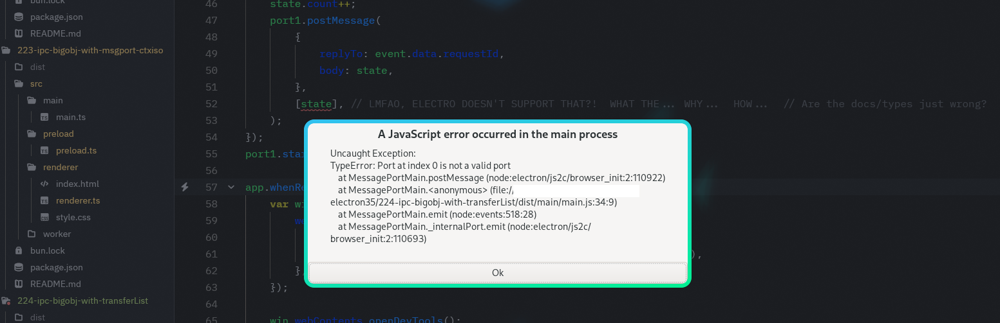

Demo: How fast are MessagePort?  renderer-to-main with large payloads, with contextIsolation on, but now using the transferList.
========

Syke!  You can't do this.

Once we're over in either the preload or the renderer code, we have `MessagePort` types, which can handle `transferList`.
`MessagePort` has a `postMessage(message: any, transfer: Transferable[]): void;` method on the outbound route,
and on the receiving side it's simply transparent.

But in the main code?  We have only the `Electron.MessagePortMain` type,
which has the `postMessage(message: any, transfer?: MessagePortMain[]): void;` function.

Notice how that `transfer` parameter there is *only* for other `MessagePortMain` values.

The other way we can send things from main to renderer is `postMessage(channel: string, message: any, transfer?: MessagePortMain[]): void;`
on `Electron.View` (see https://electronjs.org/docs/api/view ), and... again: notice how that `transfer` parameter *only* allows `MessagePortMain` values.

So.  Okay.  Nothing to benchmark here: it just can't be done.

Moving on.

### are you sure?  is that just a docs or incorrect type declarations issue?

Yeah, I'm sure.  I tried, just in case.

This is on Electron version 35.

As an aside, this is the first time I've seen an error cause a whole new window pop up from electron.
I've seen things go out to the terminal; I've seen things showing up in the dev console; and I've seen things get swallowed entirely to goodness knows where; and this, a whole new popup window... this is a first.
Props to Electron for keeping it funky, fresh, and always surprising.
